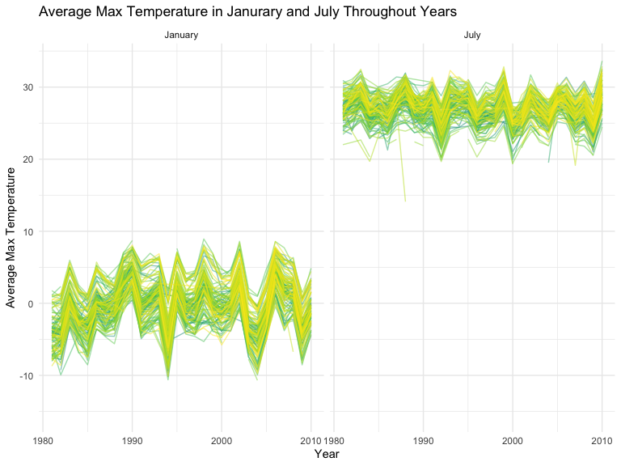

Homework 3 Solutions
================
Matthew Ma
2022-10-16

### Problem 1

``` r
data("instacart")

instacart = 
  instacart %>% 
  as_tibble(instacart)
```

#### Answer questions about the data

This dataset contains 1384617 rows and 15 columns, with each row
resprenting a single product from an instacart order. Variables include
identifiers for user, order, and product; the order in which each
product was added to the cart. There are several order-level variables,
describing the day and time of the order, and number of days since prior
order. Then there are several item-specific variables, describing the
product name (e.g. Yogurt, Avocado), department (e.g. dairy and eggs,
produce), and aisle (e.g. yogurt, fresh fruits), and whether the item
has been ordered by this user in the past. In total, there are 39123
products found in 131209 orders from 131209 distinct users.

Below is a table summarizing the number of items ordered from aisle. In
total, there are 134 aisles, with fresh vegetables and fresh fruits
holding the most items ordered by far.

``` r
instacart %>% 
  count(aisle) %>% 
  arrange(desc(n))
```

    ## # A tibble: 134 × 2
    ##    aisle                              n
    ##    <chr>                          <int>
    ##  1 fresh vegetables              150609
    ##  2 fresh fruits                  150473
    ##  3 packaged vegetables fruits     78493
    ##  4 yogurt                         55240
    ##  5 packaged cheese                41699
    ##  6 water seltzer sparkling water  36617
    ##  7 milk                           32644
    ##  8 chips pretzels                 31269
    ##  9 soy lactosefree                26240
    ## 10 bread                          23635
    ## # … with 124 more rows

ext is a plot that shows the number of items ordered in each aisle.
Here, aisles are ordered by ascending number of items.

``` r
instacart %>% 
  count(aisle) %>% 
  filter(n > 10000) %>% 
  mutate(aisle = fct_reorder(aisle, n)) %>% 
  ggplot(aes(x = aisle, y = n)) + 
  geom_point() + 
  labs(title = "Number of items ordered in each aisle") +
  theme(axis.text.x = element_text(angle = 60, hjust = 1))
```


Our next table shows the three most popular items in aisles
`baking ingredients`, `dog food care`, and `packaged vegetables fruits`,
and includes the number of times each item is ordered in your table.

``` r
instacart %>% 
  filter(aisle %in% c("baking ingredients", "dog food care", "packaged vegetables fruits")) %>%
  group_by(aisle) %>% 
  count(product_name) %>% 
  mutate(rank = min_rank(desc(n))) %>% 
  filter(rank < 4) %>% 
  arrange(desc(n)) %>%
  knitr::kable()
```

| aisle                      | product_name                                  |    n | rank |
|:---------------------------|:----------------------------------------------|-----:|-----:|
| packaged vegetables fruits | Organic Baby Spinach                          | 9784 |    1 |
| packaged vegetables fruits | Organic Raspberries                           | 5546 |    2 |
| packaged vegetables fruits | Organic Blueberries                           | 4966 |    3 |
| baking ingredients         | Light Brown Sugar                             |  499 |    1 |
| baking ingredients         | Pure Baking Soda                              |  387 |    2 |
| baking ingredients         | Cane Sugar                                    |  336 |    3 |
| dog food care              | Snack Sticks Chicken & Rice Recipe Dog Treats |   30 |    1 |
| dog food care              | Organix Chicken & Brown Rice Recipe           |   28 |    2 |
| dog food care              | Small Dog Biscuits                            |   26 |    3 |

Finally is a table showing the mean hour of the day at which Pink Lady
Apples and Coffee Ice Cream are ordered on each day of the week. This
table has been formatted in an untidy manner for human readers. Pink
Lady Apples are generally purchased slightly earlier in the day than
Coffee Ice Cream, with the exception of day 5.

``` r
instacart %>%
  filter(product_name %in% c("Pink Lady Apples", "Coffee Ice Cream")) %>%
  group_by(product_name, order_dow) %>%
  summarize(mean_hour = mean(order_hour_of_day)) %>%
  spread(key = order_dow, value = mean_hour) %>%
  knitr::kable(digit=2)
```

    ## `summarise()` has grouped output by 'product_name'. You can override using the
    ## `.groups` argument.

| product_name     |     0 |     1 |     2 |     3 |     4 |     5 |     6 |
|:-----------------|------:|------:|------:|------:|------:|------:|------:|
| Coffee Ice Cream | 13.77 | 14.32 | 15.38 | 15.32 | 15.22 | 12.26 | 13.83 |
| Pink Lady Apples | 13.44 | 11.36 | 11.70 | 14.25 | 11.55 | 12.78 | 11.94 |

### Problem 2

### Load tidy and wrangle the data

``` r
acc_df = 
  read_csv("data/accel_data.csv") %>% 
  janitor::clean_names() %>%
  pivot_longer(
    activity_1:activity_1440,
    names_to = "minutes",
    values_to = "activity_count"
  ) %>% 
  mutate( minutes = str_sub(minutes,10),
          minutes = as.numeric(minutes),
          day = forcats::fct_relevel(day, "Sunday", "Monday", "Tuesday", "Wednesday", "Thursday", "Friday", "Saturday"),
          week_days = ifelse(day == "Saturday" | day == "Sunday", "weekend", "weekday")) %>% 
  select(week, day_id, day, week_days, everything()) %>% 
  arrange(week, day)
```

    ## Rows: 35 Columns: 1443
    ## ── Column specification ────────────────────────────────────────────────────────
    ## Delimiter: ","
    ## chr    (1): day
    ## dbl (1442): week, day_id, activity.1, activity.2, activity.3, activity.4, ac...
    ## 
    ## ℹ Use `spec()` to retrieve the full column specification for this data.
    ## ℹ Specify the column types or set `show_col_types = FALSE` to quiet this message.

-   The dataset `acc_df` has 50400 observations and 6 variables with the
    names week, day_id, day, week_days, minutes, activity_count

``` r
acc_df %>% 
  group_by(week, day) %>% 
  summarize(sum_activity = sum(activity_count, na.rm = TRUE)) %>%
  pivot_wider(
    names_from = "day",
    values_from = "sum_activity"
  ) %>% 
  knitr::kable(digits = 2)
```

    ## `summarise()` has grouped output by 'week'. You can override using the
    ## `.groups` argument.

| week | Sunday |    Monday |  Tuesday | Wednesday | Thursday |   Friday | Saturday |
|-----:|-------:|----------:|---------:|----------:|---------:|---------:|---------:|
|    1 | 631105 |  78828.07 | 307094.2 |    340115 | 355923.6 | 480542.6 |   376254 |
|    2 | 422018 | 295431.00 | 423245.0 |    440962 | 474048.0 | 568839.0 |   607175 |
|    3 | 467052 | 685910.00 | 381507.0 |    468869 | 371230.0 | 467420.0 |   382928 |
|    4 | 260617 | 409450.00 | 319568.0 |    434460 | 340291.0 | 154049.0 |     1440 |
|    5 | 138421 | 389080.00 | 367824.0 |    445366 | 549658.0 | 620860.0 |     1440 |

### Making a plot to distinguish a trend

``` r
acc_df %>% 
  group_by(week, day) %>% 
  summarize(sum_activity = sum(activity_count, na.rm = TRUE)) %>% 
  ggplot(aes(x = day, y = sum_activity, group = week, color = week)) +
  geom_point() + 
  geom_line()
```

    ## `summarise()` has grouped output by 'week'. You can override using the
    ## `.groups` argument.


-   There is no apparent trend to be spotted on the graph. However,
    there are extremely low values spotted on the weekend compared to
    weekday.

### Make a single-panel plot that shows the 24-hour activity time courses for each day and use color to indicate day of the week.

``` r
acc_df %>% 
  mutate(hour = minutes / 60) %>% 
  ggplot(aes(x = hour, y = activity_count, color = day)) + 
  geom_line(alpha = 1)
```


-   From this graph, we can conclude that there is a low activity count
    at night roughly from 11pm to 6am in the morning. The patient is
    most likely sleeping during the time period which explains the low
    activity count. And the activity starts to rise up after 6 am.
    Following a stable curve to rise up to the highest when it gets
    close to noon. Then there is a fluctuation between 12pm to 7pm. The
    activity count is the highest before the patient goes to sleep.

### Problem 3

``` r
data("ny_noaa")

ny_df = 
  ny_noaa %>% 
  as_tibble(ny_noaa)

summary(ny_df)
```

    ##       id                 date                 prcp               snow       
    ##  Length:2595176     Min.   :1981-01-01   Min.   :    0.00   Min.   :  -13   
    ##  Class :character   1st Qu.:1988-11-29   1st Qu.:    0.00   1st Qu.:    0   
    ##  Mode  :character   Median :1997-01-21   Median :    0.00   Median :    0   
    ##                     Mean   :1997-01-01   Mean   :   29.82   Mean   :    5   
    ##                     3rd Qu.:2005-09-01   3rd Qu.:   23.00   3rd Qu.:    0   
    ##                     Max.   :2010-12-31   Max.   :22860.00   Max.   :10160   
    ##                                          NA's   :145838     NA's   :381221  
    ##       snwd            tmax               tmin          
    ##  Min.   :   0.0   Length:2595176     Length:2595176    
    ##  1st Qu.:   0.0   Class :character   Class :character  
    ##  Median :   0.0   Mode  :character   Mode  :character  
    ##  Mean   :  37.3                                        
    ##  3rd Qu.:   0.0                                        
    ##  Max.   :9195.0                                        
    ##  NA's   :591786

``` r
ny_df = 
  ny_noaa %>% 
  janitor::clean_names() %>%
  separate(col = date, into = c('year', 'month', 'day'), sep = "-", convert = TRUE) %>%
  mutate(
    month = month.name[month],
    tmax = as.numeric(tmax),
    tmin = as.numeric(tmin),
    tmax = tmax/10,
    tmin = tmin/10,
    prcp = prcp/10)

ny_df %>% 
  count(snow, name = "n_obs") %>% 
  arrange(desc(n_obs))
```

    ## # A tibble: 282 × 2
    ##     snow   n_obs
    ##    <int>   <int>
    ##  1     0 2008508
    ##  2    NA  381221
    ##  3    25   31022
    ##  4    13   23095
    ##  5    51   18274
    ##  6    76   10173
    ##  7     8    9962
    ##  8     5    9748
    ##  9    38    9197
    ## 10     3    8790
    ## # … with 272 more rows

-   The most commonly observed value for snow is 0 because snow days are
    rare in New York which only happen during winter. Most of the other
    time there is no snow.

### Make a two panel plot showing the average max temperature of Janurary and July

``` r
ny_df %>%
  group_by(id, year, month) %>% 
  filter(month == c("January", "July")) %>% 
  summarize(avg_tmax = mean(tmax)) %>% 
  ggplot(aes(x = year, y = avg_tmax, color = month)) +
  geom_point() +
  facet_grid(. ~ month) +
  labs( x = "Year",
        y = "Average Max Temperature",
        title = "Average Max Temperature in Janurary and July Throughout Years")
```

    ## `summarise()` has grouped output by 'id', 'year'. You can override using the
    ## `.groups` argument.



-   There is a clear difference in the average max temperature between
    January and July from 1980 to 2010. The average max temperature of
    January is clearly lower than that of July. There are outliers in
    1982 January and 1988 July. For both months the average max
    temperature fluctuate.

### Make a plot showing tmax and tmin, make a plot showing the snow values greater than 0 and less than 100 in a year (separately).

``` r
tmax_vs_tmin = 
  ny_df %>% 
  ggplot(aes(x = tmin, y = tmax)) +
  geom_hex() +
  labs( x = "Minimum Temperature in Celsiusc",
        y = "Maximum Temperature in Celsius",
        title = " Tmax vs Tmin")

snowfall = 
  ny_df %>% 
  filter(snow > 0 & snow < 100) %>% 
  mutate(
    year = as.factor(year)
  ) %>% 
  ggplot(aes(x = snow, y = year)) +
  geom_density_ridges(scale = .5) + 
  theme(legend.position = "none") +
  labs( x = "Snowfall in mm",
        y = "Years",
        title = "Snowfall Throughout the Years")

tmax_vs_tmin + snowfall
```

    ## Picking joint bandwidth of 3.76


